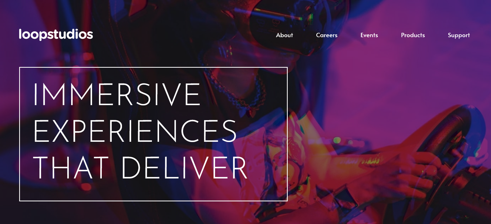

# Frontend Mentor - Loopstudios landing page solution

This is a solution to the [Loopstudios landing page challenge on Frontend Mentor](https://www.frontendmentor.io/challenges/loopstudios-landing-page-N88J5Onjw). Frontend Mentor challenges help you improve your coding skills by building realistic projects.

## Table of contents

- [Overview](#overview)
  - [The challenge](#the-challenge)
  - [Screenshot](#screenshot)
  - [Links](#links)
- [My process](#my-process)
  - [Built with](#built-with)
  - [What I learned](#what-i-learned)
- [Author](#author)

## Overview

### The challenge

Users should be able to:

- View the optimal layout for the site depending on their device's screen size
- See hover states for all interactive elements on the page

### Screenshot

### Links

- Solution URL: [Frontend Mentor Solution Page](https://www.frontendmentor.io/solutions/loopstudios-landing-page-using-css-flexbox-css-grid-css-media-query-kCgY0NQOzT)
- Live Site URL: [Live Site](https://loopstudios-landing-page-zeta-one.vercel.app/)

## My process

### Built with

- Semantic HTML5 markup
- CSS custom properties
- Flexbox
- CSS Grid
- Vanilla Javascript

### What I learned

I learned how to work with CSS Grid (grid-template-areas), how to create effective hover animations, and develop responsive designs, particularly for the navigation bar.

## Author

- Frontend Mentor - [@bangkitPk](https://www.frontendmentor.io/profile/bangkitPk)
